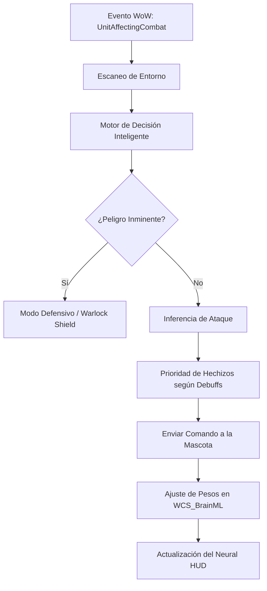

# 📐 Wiki: Arquitectura 'Diamond Tier' — WCS_Brain [v7.1.0]

Estructura técnica del **Neural Core** de **El Séquito del Terror** mantenido por **DarckRovert**.

## 🏗️ Jerarquía del Núcleo Neuronal (Neural Hierarchy)

El motor de **WCS_Brain** interactúa con el cliente WoW (1.12.1) y gestiona las decisiones tácticas mediante capas neuronales:

1.  **Hueso Central (`WCS_Core.lua`)**: Registro de eventos y gestor de datos.
2.  **Motor de Inferencia (`WCS_BrainPetAI.lua`)**: Toma decisiones de combate instantáneas basadas en el estado del objetivo.
3.  **Sistema de Aprendizaje (`WCS_BrainML.lua`)**: Motor ML que reconoce patrones de combate y ajusta los pesos de decisión.
4.  **Sistema de Seguridad (`WCS_BrainSafety.lua`)**: Garantiza la integridad de los Soul Shards y los recursos de Brujo.
5.  **Neural HUD (`WCS_BrainUI.lua`)**: Visualizador de telemetría táctica (Telemetría en tiempo real).

---

## 🌐 Diagrama de Flujo: Inferencia Táctica v7.1

## ⚡ Estrategias de Ingeniería Neural Diamond Tier

- **Asynchronous Pattern Scanning**: El escaneo de patrones ML se ejecuta en ráfagas de 5ms para no comprometer los FPS.
- **Neural Throttling (0.2s)**: Todas las actualizaciones globales están reguladas para sincronizarse con el ciclo de red de WoW.
- **Resource Protection Logic**: El sistema prioriza el ahorro de Soul Shards sobre cualquier automatización táctica menor.

---
© 2026 **DarckRovert** — El Séquito del Terror.
*Ingeniería de vanguardia para la élite de Azeroth.*
